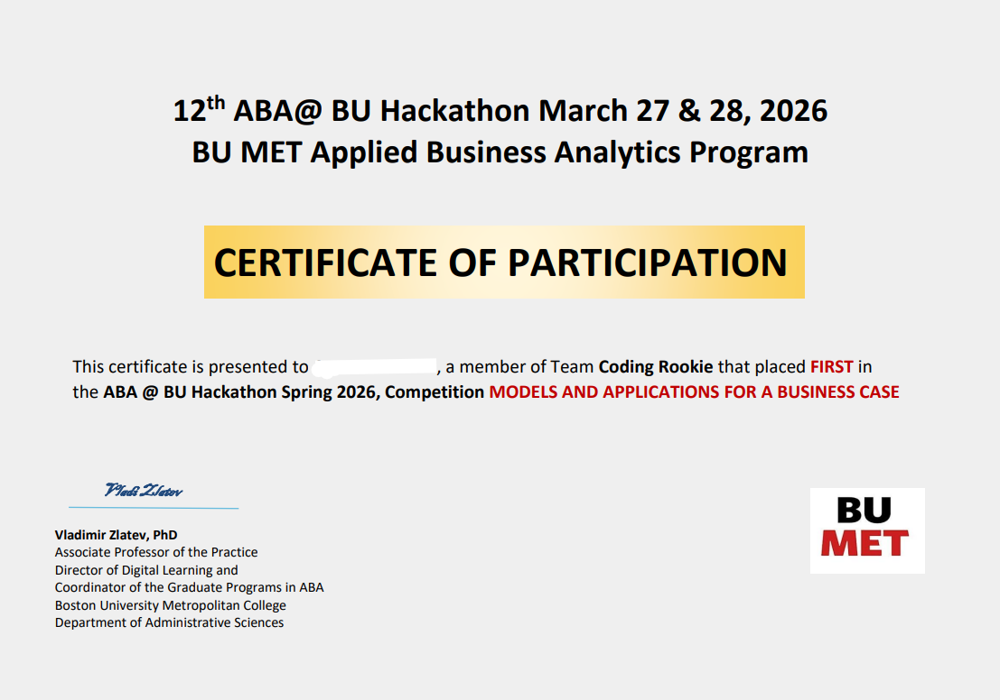

# 🧠 Team Coding Rookie - Intertemporal Choice Analysis

<table>
<tr>
<td>

### 🏆 1st Place in Data Hackathon Spring 2026

We competed against teams from different backgrounds and took home the **winning title**.

<sub><a href="https://apoorvverma.github.io/coding-rookie/">View the full presentation here!</a></sub>

</td>
</tr>
<tr>
<td>

</td>
</tr>
</table>

---

> Analyzing when and why people choose smaller-sooner vs. larger-later rewards across 800k+ trials, and building predictive models to inform streaming subscription tier strategy.

---

## 📁 Project Structure

```
coding-rookie/
├── Data_Hackathon_Analysis.ipynb   # Full EDA notebook (Colab/Jupyter)
├── data_hackathon_analysis.py      # EDA — equivalent Python script
├── predictive_model.py             # Modeling pipeline (LR, RF, XGBoost)
├── images/                         # Exported charts for GitHub Pages
├── index.html                      # GitHub Pages presentation site
├── requirements.txt                # Python dependencies
└── README.md
```

## 🚀 Quick Start

```bash
# 1. Clone the repo
git clone https://github.com/apoorvverma/coding-rookie.git
cd coding-rookie

# 2. Install dependencies
pip install -r requirements.txt

# 3. Place the raw dataset in the project root
#    Expected file: all_data.csv

# 4. Run the full pipeline
python data_hackathon_analysis.py      # Step 1: Clean data → clean_data_basic.csv
python predictive_model.py             # Step 2: Train models + generate plots
```

Alternatively, open `Data_Hackathon_Analysis.ipynb` in [Google Colab](https://colab.research.google.com/) or Jupyter and run all cells sequentially, then run `predictive_model.py`.

## 🔬 Analytical Pipeline

### 1. Data Preparation
- Loaded raw multi-study CSV (~800k+ trials, 20 columns)
- Enforced binary `choice` (0 = SS, 1 = LL), coerced numeric types
- Dropped rows missing core task columns (`ss_value`, `ss_time`, `ll_value`, `ll_time`)
- Removed subject-level and trial-level exclusions flagged by original authors
- Winsorized response times at the 99.5th percentile (capped, not deleted)

### 2. Feature Engineering
- `value_diff` = LL value − SS value
- `time_diff_days` = LL delay − SS delay
- `reward_ratio` = LL value / SS value
- `daily_gain` = value gained per day of waiting
- `relative_delay` = LL delay as fraction of total delay span
- `log_rt` = log-transformed response time (reduces skew for linear models)
- `age_group` — binned into 12 granular brackets
- Encoded categoricals: procedure, incentivization, presentation format, fixed attributes

### 3. Exploratory Analysis
| Question | Method |
|----------|--------|
| Delay structure (SS vs LL) | Count plots + boxplots by time bucket |
| Overall choice balance | Pie chart of SS/LL split |
| Reward ratio tipping point | Decile-binned LL rate curve → **~1.29× threshold** |
| Country-level variation | Horizontal bar charts (filtered to n > 500) |
| Age effects on choice & RT | Bar plots + boxplots by granular age group |
| RT vs reward ratio | Scatter + regression (Pearson r ≈ 0) |
| Context variables | LL rate by procedure, incentivization, online/lab, time pressure |

### 4. Predictive Modeling

Three models trained on 80/20 stratified split (subsampled to 300k rows for speed):

| Model | Purpose |
|-------|---------|
| **Logistic Regression** | Interpretable baseline — signed coefficients reveal direction of each feature's effect on patience |
| **Random Forest** | Non-linear interactions (e.g., ratio × age) with feature importance ranking |
| **XGBoost** | Best raw predictive performance; gradient boosting benchmark |

**Evaluation metrics:** Accuracy, AUC-ROC, confusion matrices, ROC curves, feature importance plots.

### 5. Business Application — Streaming Subscription Tiers
Our models map directly to the streaming platform scenario:
- **SS (0) → Free / ad-supported tier** (immediate gratification)
- **LL (1) → Premium tier** (delayed payoff, higher value)

Key recommendations derived from model outputs:
- Price premium tiers at ≥1.29× the perceived value of the free tier
- A/B test upgrade prompt FORMAT before segmenting by demographics
- Use model predictions to personalize upgrade timing and messaging
- Offer shorter commitment periods to high-SS-probability user segments

## 📊 Key Findings

- **Tipping ratio ~1.29×** — LL adoption crosses 50% when the larger option is ≥ 29% more valuable
- **Task design dominates** — procedure type explains ~30pp spread in LL rates, more than any demographic
- **Online ≠ lab** — digital settings trend ~8pp more impatient
- **Age slows RT, not patience linearly** — older groups are slower and more variable
- **Best model AUC 0.80–0.86** — strong predictive signal from task-level and contextual features

## 🛠️ Tech Stack

- **Python 3.10+**
- pandas, NumPy — data wrangling
- matplotlib, seaborn — visualization
- scikit-learn — logistic regression, random forest, evaluation metrics
- XGBoost — gradient boosted classifier

## 🤖 AI Disclosure

This project used AI tools during development, in accordance with hackathon guidelines:

- **Claude (Anthropic)** — Used for coding assistance (model pipeline scaffolding, plot formatting), documentation drafting (README, GitHub Pages site structure), and conceptual clarification (feature engineering rationale, business framing). All AI-generated code was reviewed, tested, and modified by the team.
- **Google Colab** — Development environment with built-in AI code suggestions.

All team members understand the methods used, can explain every modeling decision, and have verified all outputs. AI tools accelerated implementation but did not replace analytical judgment.

## 👥 Team
- Tran Phuong Ngoc Ngo
- Sudhir, Antara
- Hamra Marchand, Simon
- Verma, Apoorv

**Team Coding Rookie**

---

<sub>Results presented at [apoorvverma.github.io/coding-rookie](https://apoorvverma.github.io/coding-rookie/)</sub>